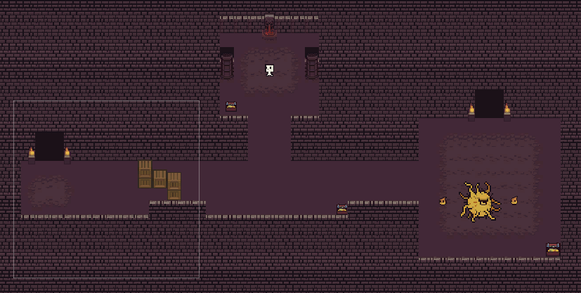

# Top-Down-Dungeon-2D-RPG

This is a prototype of a Top-Down 2D Role Playing Game (RPG) using Unity's Tilemap system. It consists of 2 levels, an initial level for learning the controls and interactions, and a second level with enemies. When moving to a different level (either previous or next), the game's state is saved automatically.

<!--  -->

On the Main Menu, the Player can find all the necessary character information, namely: Health, Level (weapon), Gold and Experience. Moreover, the Player can use the arrows under the character to change their sprite.

On the first level, the Player can move towards an NPC, which prompts a hint on collision, informing the Player on how to use their sword. On Spacebar keypress, the swords animates downwards in a semicircular fashion, and then returns to its original place.

To progress the story, the Player moves towards the "faintly indicated" gateway, where stairs, pillars, animated torches and gateway fountains are placed to indirectly indicate the "right way".

On the next level, the Player can encounter enemies, like a low-level creature or a higher-level boss with 2 rotating damage-dealing fires around them. By killing them, the Player gains experience points. Boss kill also awards full-hp healing. On level 2, the Player can also find treasure chests that contain gold, which can be used to upgrade the sword level.

In case the Player takes damage from enemy encounters, he can heal themselves up by visiting the healing fountain, located on the first creature's area.

There is a strategical treasure chest located on the down-right corner of the boss area. Up to the boss fight, the Player cannot possibly find 30 gold, needed for upgrading the weapon's level (Sword Level 1 deals 1 damage, Level 2 deals 2 damage, etc.). The boss-area chest contains exactly 30 gold, to provide a weapon levelup, even if previous chests were not collected. If the Player is skilled enough to avoid the boss and get to the chest first, or is willing to take some damage for it, they will be rewarded with enough gold to upgrade their sword and defeat the boss easier.

On fatal damage, meaning when the Player's hp reaches 0, a death screen appears. If the Player wishes to return to the game, the click on "Respawn", which respawns the Player on level 1 with full hp, keeping the gained gold, experience and weapon level.

